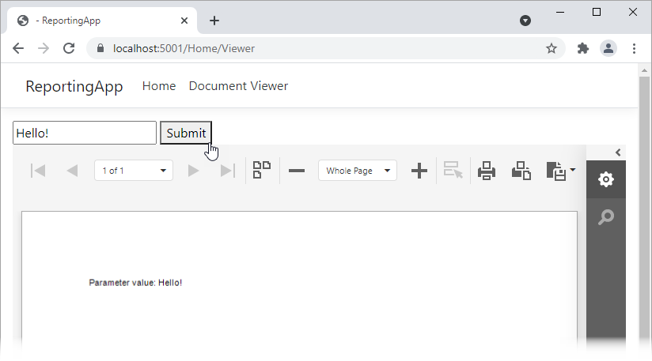

<!-- default badges list -->

<!-- default badges end -->
# Reporting for ASP.NET Core - Specify Parameter Value on Button Click

This example demonstrates how to submit parameter values on button click and use the [Document Viewer's Client-Side API](https://docs.devexpress.com/XtraReports/401793?v=21.1) to pass the values to the report.

## How to Run the Example

1. Download the project and update NuGet packages.
2. Build and run the project.
3. Navigate to a page that contains the document viewer.
4. Enter a parameter value in the editor and click the *Submit* button.

 ## Files to Review

* [Viewer.cshtml](CS/ReportingApp/Views/Home/Viewer.cshtml)
* [CustomReportStorageWebExtension.cs](CS/ReportingApp/Services/CustomReportStorageWebExtension.cs#L45)

## Documentation

* [Specify Parameter Values in an ASP.NET Core Reporting Application](https://docs.devexpress.com/XtraReports/403229).
